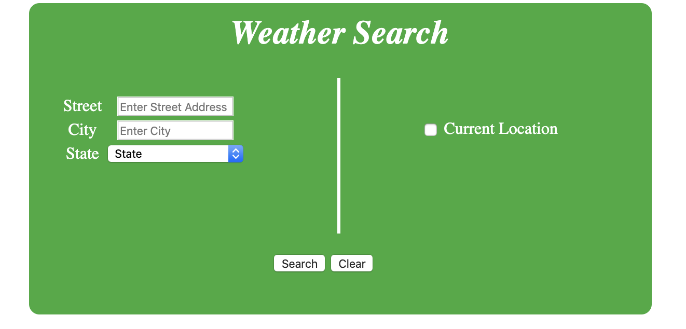
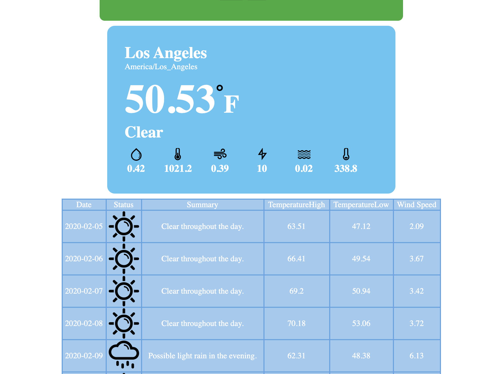
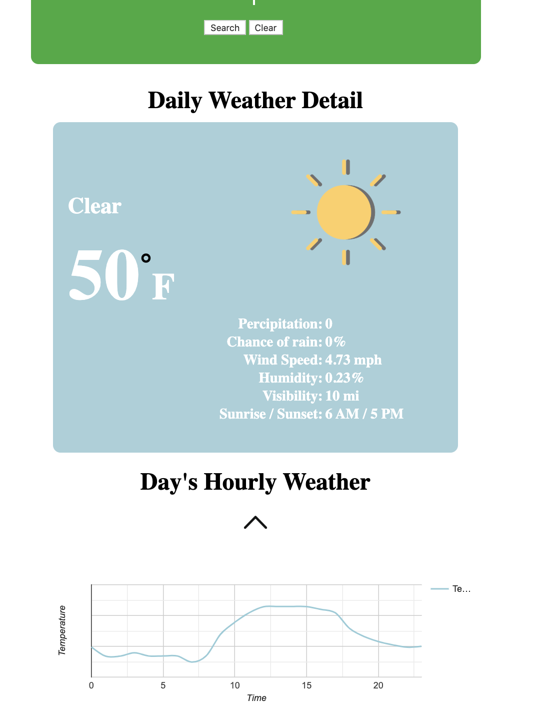

# weather-search-php

## Description
A user first opens a page, called forecast.php (or any valid web page name), where they can enter an address (street, city, and state)
The PHP script forecast.php (or whatever your valid page name is) will use the address information (street, city, and state) to construct a web service URL to query the Google Geocode API appropriately
Next, using the latitude and longitude values, another web service URL needs to be constructed to query the forecast.io API to get the weather information for the given location.
The weather forecast is then displayed in a card view and a tabular summary for the week.
On clicking the summary present in the table, the page displays a detailed description of the weather

##Screenshots

